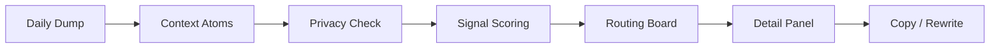
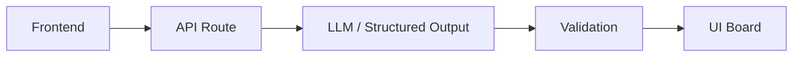
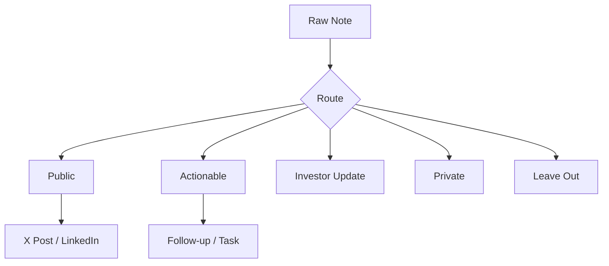

# ContextRouter

**An AI routing board for messy daily founder context.**

Deployment: [https://context-router.vercel.app/](https://context-router.vercel.app/)

ContextRouter turns a raw daily dump into routed, source-backed outputs: X posts, LinkedIn posts, follow-ups, tasks, investor updates, private warnings, and things to leave out.

It is not a general writing assistant. The app starts from "what happened today?", breaks that context into traceable atoms, checks privacy and signal, then shows what each piece should become.

## Table of Contents

- [Why I Built It](#why-i-built-it)
- [Product Summary](#product-summary)
- [Key Features](#key-features)
- [Demo Flow](#demo-flow)
- [How the AI Routing Works](#how-the-ai-routing-works)
- [Architecture Overview](#architecture-overview)
- [Tech Stack](#tech-stack)
- [Local Setup](#local-setup)
- [Environment Variables](#environment-variables)
- [Project Structure](#project-structure)
- [Screenshots](#screenshots)
- [What I Deliberately Cut](#what-i-deliberately-cut)
- [What I Would Do With Another 10 Hours](#what-i-would-do-with-another-10-hours)
- [Limitations](#limitations)

## Why I Built It

Useful founder context gets created every day in calls, notes, product work, user feedback, investor conversations, reminders, and half-formed thoughts. Most of it dies because it is not obvious what each piece should become.

Most AI writing tools ask:

> What do you want to write?

ContextRouter asks:

> What actually happened today?

That difference matters. A founder's day is not one clean prompt. It is the raw material for public proof-of-work, follow-ups, tasks, investor updates, private warnings, and notes that should be ignored.

The goal is not more AI slop. The goal is useful, grounded, source-backed outputs.

The part I care about most is judgment: deciding what each piece of context should become, and just as importantly, what should not become content at all.

## Product Summary

ContextRouter is a single-page web app with three main areas:

| Area | Purpose |
| --- | --- |
| Input panel | Paste a daily dump, optional writing samples, and choose a mode. |
| Routing board | Review cards grouped by destination bucket. |
| Detail panel | Inspect the selected card, source notes, route reason, risk flags, quality scores, and rewrite actions. |

The core loop is:

```txt
daily dump -> context atoms -> privacy and signal checks -> routed cards -> visual board -> copyable outputs
```

## Key Features

- Manual daily dump input with a 5,000 character MVP limit.
- Optional writing samples with a 3,000 character limit for voice matching.
- Four modes: Founder, Student Builder, Operator, and Creator.
- Seven routing buckets: X Post, LinkedIn, Follow-ups, Tasks, Investor Update, Private, and Leave Out.
- Intentional Leave Out routing for weak, generic, unsupported, or unsafe-to-publish notes.
- Traceable context atoms with source snippets, cleaned meaning, sensitivity, signal score, confidence, and routing notes.
- Source-backed cards with cited atom IDs and claim/source entries.
- Privacy-aware routing validators that block private or internal-only content from unsafe public buckets.
- Deterministic validation for missing sources, unknown atom references, private leakage, and unsupported public claims.
- Structured model output through the Vercel AI SDK and Zod schemas.
- One strict retry when the first model output fails blocking validation.
- Detail panel with editable draft text, sources, routing reason, checks, risk flags, and copy actions.
- Card-level rewrite endpoint for actions such as making a card sharper, shorter, more public-safe, or closer to the user's voice.
- Recent run history stored in Neon Postgres and merged into browser localStorage for a fast local cache.
- Clear UI states for routing progress, success, validation errors, missing API key, model failure, quota failure, and database failure.

## Demo Flow

1. Open the deployed app or run it locally.
2. Choose a sample from the sample data dropdown, or paste a real daily dump.
3. Optionally paste a few writing samples.
4. Pick a mode.
5. Click **Route Context**.
6. Wait for the routing pipeline:
   - extracting context atoms
   - checking private details
   - scoring signal
   - routing to output buckets
   - drafting outputs
   - running the anti-slop check
7. Review the routing board.
8. Select any card to inspect sources, reasons, risk flags, and quality scores.
9. Copy the card, edit the draft, or run a focused rewrite.



## How the AI Routing Works

The AI path is intentionally small and inspectable.

1. The frontend sends `dailyDump`, `voiceSamples`, and `mode` to `POST /api/route-context`.
2. The API validates the request with `RouteContextRequestSchema`.
3. The routing layer builds a prompt that requires atom extraction, sensitivity classification, signal scoring, routing, drafting, and slop checks.
4. The Vercel AI SDK calls the configured OpenAI model with `generateObject`.
5. The response must match `RouteContextModelOutputSchema`.
6. Deterministic validators run after the model:
   - every card must cite source atoms
   - cards cannot reference missing atom IDs
   - private atoms cannot feed public or investor outputs
   - internal-only atoms cannot feed public posts
   - public and investor cards should include source-supported claims
7. If blocking validation fails, the app retries once with a stricter repair prompt.
8. If the final result passes, the API adds a run ID and timestamp, persists the run, and returns the board.



The routing categories are explicit:



## Architecture Overview

ContextRouter is a Next.js App Router project with frontend, API routes, AI orchestration, schemas, validators, and persistence in one repo.

| Layer | Files | Responsibility |
| --- | --- | --- |
| UI shell | `app/page.tsx` | Holds input state, selected card state, routing calls, rewrite calls, history loading, and board layout. |
| Input components | `components/input/*` | Daily dump textarea, writing samples, mode selector, sample data picker, route button. |
| Board components | `components/board/*` | Bucket columns, output cards, empty bucket states. |
| Detail components | `components/detail/*` | Draft editor, source display, quality scores, risk flags, rewrite actions. |
| API routes | `app/api/<route>/route.ts` | Request parsing, error envelopes, routing, rewriting, and run history. |
| AI layer | `lib/ai/*` | Prompt construction, model configuration, structured generation, retry behavior. |
| Schemas | `lib/schemas/*` | Zod contracts for atoms, cards, requests, model output, API errors, and rewrites. |
| Validators | `lib/validators/*` | Deterministic safety and source-support checks after model output. |
| Persistence | `lib/db/*`, `migrations/*` | Neon Postgres client, run save/list helpers, and the `runs` table migration. |
| Local cache | `lib/history/localHistory.ts` | Browser localStorage cache for recent runs. |

API surface:

| Route | Method | Purpose |
| --- | --- | --- |
| `/api/route-context` | `POST` | Route a daily dump into atoms, buckets, drafts, checks, and validation issues. |
| `/api/rewrite-card` | `POST` | Rewrite one selected card while preserving source support and safety constraints. |
| `/api/runs` | `GET` | Load recent persisted route runs. |

## Tech Stack

| Category | Technology |
| --- | --- |
| Framework | Next.js 16 App Router |
| UI | React 19, TypeScript, Tailwind CSS 4 |
| Icons and UI helpers | lucide-react, next-themes, clsx, tailwind-merge |
| AI | Vercel AI SDK, `@ai-sdk/openai` |
| Validation | Zod 4 |
| Database | Neon Postgres via `@neondatabase/serverless` |
| Tests | Vitest, Testing Library, jsdom |
| Linting | ESLint 9 with Next.js config |

The default model is `gpt-5.4-mini`. GPT-5 model IDs use OpenAI reasoning effort through provider options; non-GPT-5 model IDs use a low temperature setting.

## Local Setup

Prerequisites:

- Node.js 20 or newer
- npm
- OpenAI API key
- Neon Postgres database URL

Install dependencies:

```bash
npm install
```

Create an environment file:

```bash
cp .env.example .env
```

Fill in `.env`, then run the database migration:

```bash
npm run db:migrate
```

Start the dev server:

```bash
npm run dev
```

Open [http://localhost:3000](http://localhost:3000).

Useful validation commands:

```bash
npm test
npm run lint
npm run build
```

## Environment Variables

| Variable | Required | Description |
| --- | --- | --- |
| `OPENAI_API_KEY` | Yes | Required for routing and card rewrites. Without it, API routes return `MISSING_API_KEY`. |
| `DATABASE_URL` | Yes | Neon Postgres connection string. Required because successful routing persists a run before returning the board. |
| `AI_MODEL` | No | Model ID for the OpenAI provider. Defaults to `gpt-5.4-mini`. |
| `AI_REASONING_EFFORT` | No | Reasoning effort for GPT-5 model IDs. Defaults to `low`. |
| `AI_PROVIDER` | No | Present in `.env.example` as `openai`. The current implementation uses the OpenAI provider path. |

Database setup uses SQL files in `migrations/`. The current migration creates a small `runs` table and an index on `created_at`.

## Project Structure

```txt
.
|-- app/
|   |-- api/
|   |   |-- route-context/route.ts
|   |   |-- rewrite-card/route.ts
|   |   `-- runs/route.ts
|   |-- layout.tsx
|   `-- page.tsx
|-- components/
|   |-- board/
|   |-- detail/
|   |-- input/
|   `-- shared/
|-- lib/
|   |-- ai/
|   |-- api/
|   |-- db/
|   |-- history/
|   |-- schemas/
|   |-- validators/
|   |-- bucket-config.ts
|   |-- sample-data.ts
|   `-- types.ts
|-- migrations/
|   `-- 0001_create_runs.sql
|-- scripts/
|   `-- migrate-db.mjs
|-- tests/
|   |-- fixtures/
|   |-- model-config.test.ts
|   |-- sample-data.test.ts
|   |-- schemas.test.ts
|   |-- validators.test.ts
|   `-- loading-pipeline.test.tsx
`-- docs/
```

## Screenshots

### Routing Board


### Source Inspection


### Rewrite Actions


### Responsive Views

| Mobile | Tablet | Desktop |
| --- | --- | --- |
|  |  |  |

## What I Deliberately Cut

This MVP is intentionally scoped around the routing loop. It does not include:

- Login, accounts, teams, workspaces, billing, or permissions.
- Gmail, Calendar, Notion, X, LinkedIn, GitHub, CRM, or publishing integrations.
- Auto-posting, scheduling, analytics, notifications, queues, or workers.
- A multi-agent backend with separate model calls for extraction, privacy, routing, drafting, and critique.
- Long-term knowledge storage beyond recent route runs.
- A full admin interface for run management.
- File uploads or voice transcription.

The cut was deliberate: the project is meant to prove whether a raw daily dump can become useful routed outputs with visible judgment and source support.

## What I Would Do With Another 10 Hours

- Add a small screenshot set and a short demo GIF.
- Add Playwright coverage for the sample-data routing flow, including error states and card rewrites.
- Add Gmail, Calendar, Notion, Obsidian, or Notes import so the daily dump can be assembled from real founder context with less manual copying.
- Add voice memo input for quick end-of-day capture.
- Add stronger voice matching from past posts instead of relying only on pasted writing samples.
- Add an optional "today's useful outputs" export for Markdown or JSON.
- Add a lightweight run detail page so a saved run can be shared or reviewed later.
- Add a privacy preview before sending the daily dump to the model.
- Add better handling for database persistence failure, such as returning the routed board while clearly warning that saving failed.
- Add a small evaluation set that checks routing behavior across founder days, meeting notes, and private-heavy inputs.

## Limitations

- The app sends user-provided text to the configured AI provider. The header warns users not to paste sensitive information.
- Routing quality depends on the model response and the quality of the input notes.
- Validation catches important structural and privacy failures, but it is not a full compliance or security system.
- The MVP has no authentication, so deployment should be treated as a public demo unless protected elsewhere.
- The main route requires database persistence to succeed before returning the board.
- Recent run history is capped at 20 runs in both the database helper and local cache.
- There is no direct posting or third-party workflow integration.
- The UI supports editing the selected draft locally, but edited draft text is not persisted back to the saved run.
