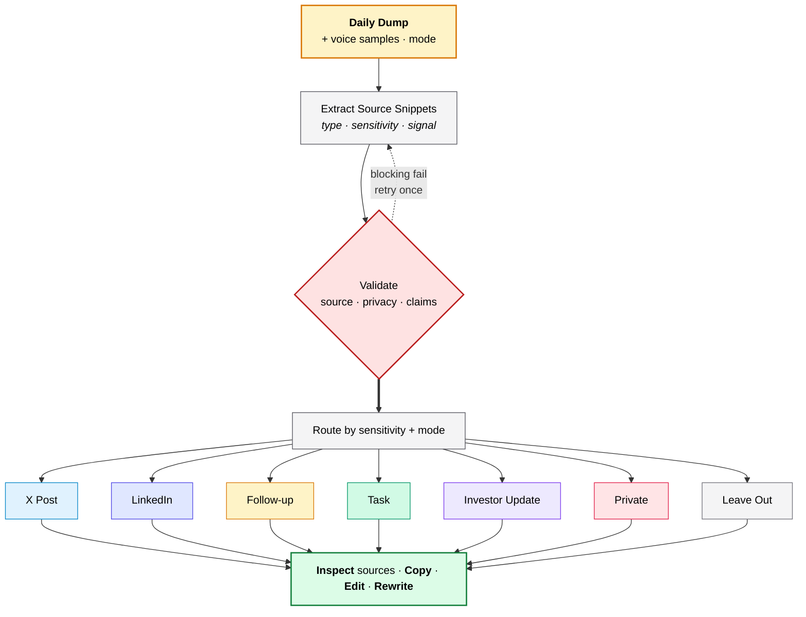
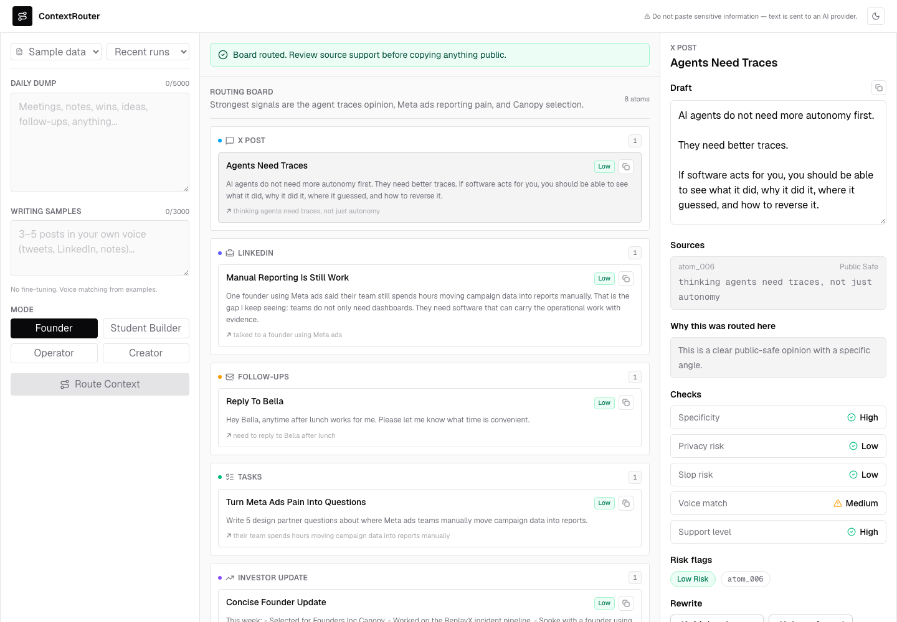
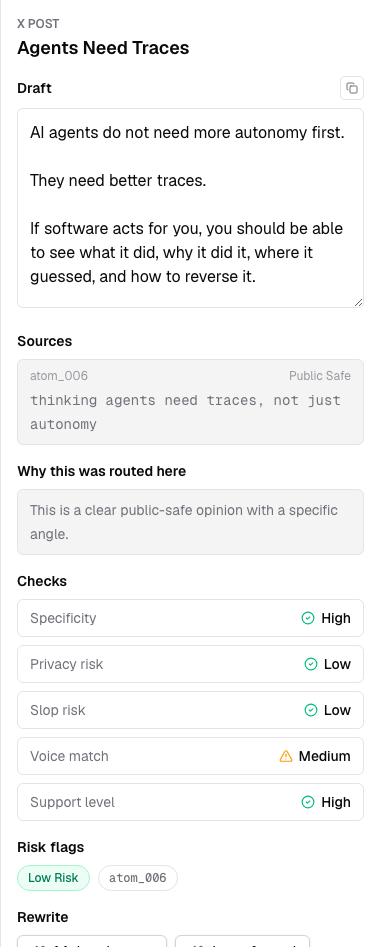
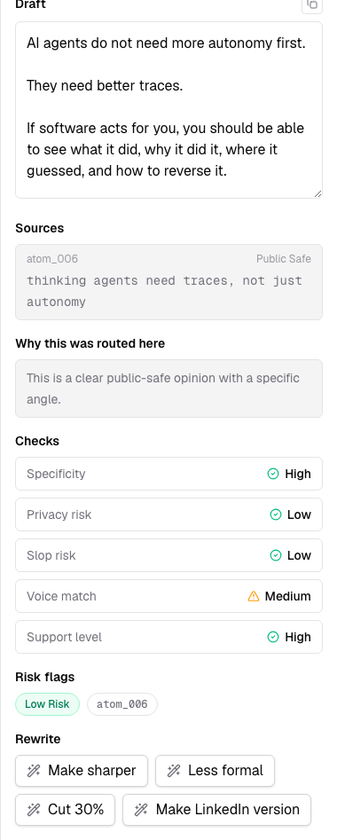
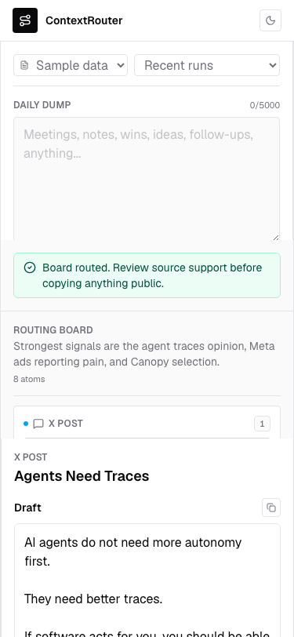
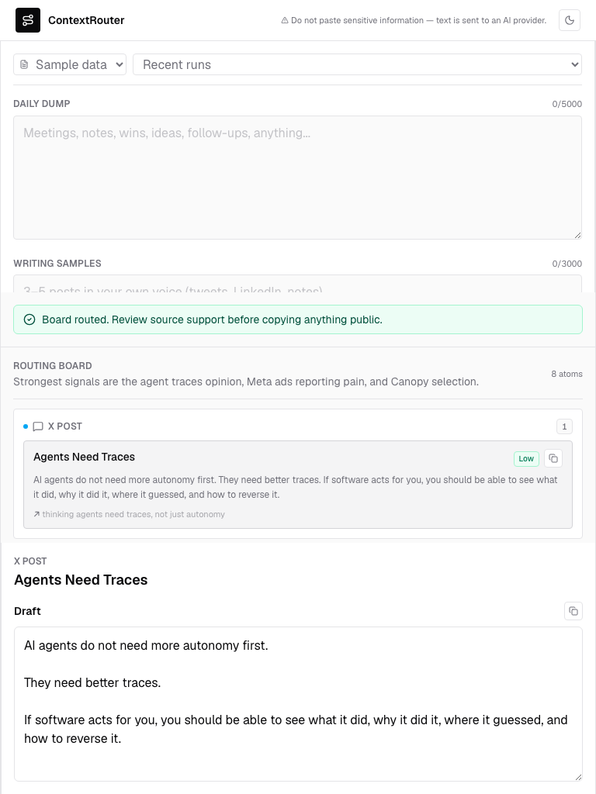
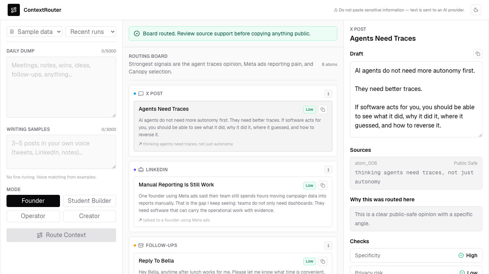
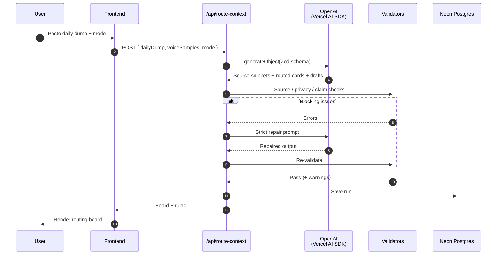
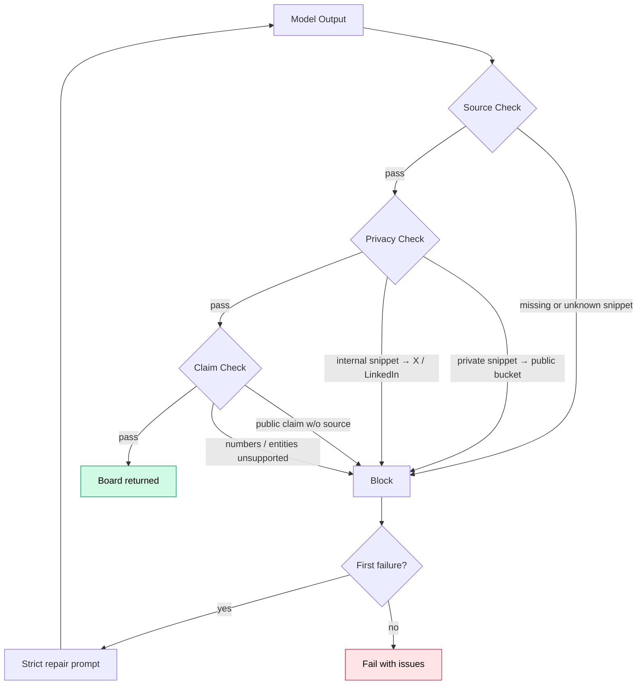

# ContextRouter

> **Turn messy founder notes into posts, follow-ups, tasks, updates, and private warnings.**

  

## Why I Built It

A founder's day is not one clean prompt. It's a pile of calls, notes, product work, user feedback, investor conversations, and half-formed thoughts. Most of it dies because it's not obvious what each piece should become.

Most AI writing tools ask:

> What do you want to write?

ContextRouter asks:

> What actually happened today?

The part I care about most is judgment: deciding what each piece of context should become, and what should not become content at all.

## A Day in the Life

You end the day with notes that look like this:

> talked to founder running meta ads for a DTC brand
> they spend 4-5 hrs/week moving data between tools
> "we have dashboards but still need ops people to make reports"
> follow up with Rohan, ask if we can watch his weekly flow
> task: turn this into 6 design partner questions
> investor-safe: clear pain in DTC reporting workflow
> private: do not mention company name publicly
> leave out: had coffee, tweaked landing page copy

ContextRouter routes it into:

| Bucket | Card |
| :--- | :--- |
| **X Post** | *Software has become the system of record, but humans are still the system of action.* |
| **LinkedIn** | Customer discovery keeps pointing to the same gap: teams have dashboards, but still need people to stitch work across tools. |
| **Follow-up** | Reply to Rohan. Ask if we can watch his weekly reporting flow next week. |
| **Task** | Turn customer conversation into 6 design partner questions about reporting ops. |
| **Investor Update** | Found clear DTC reporting pain where manual work happens between ads, reports, and client comms. |
| **Private** | Company name, ad spend, client names. Do not mention publicly. |
| **Leave Out** | Coffee + landing page copy tweaks. Low signal, not post-worthy. |

One messy dump in. Seven decisions out. Judgment visible, sources traced, noise filtered.

---

## See It in Action

### End-to-End Flow

### Routing Board

### Source Inspection & Rewrite Actions

<table align="center" width="100%">
  <tr>
    <td align="center" width="50%">
      
       
      <b>Source Inspection</b>
    </td>
    <td width="32"></td>
    <td align="center" width="50%">
      
       
      <b>Rewrite Actions</b>
    </td>
  </tr>
</table>

### Responsive Views

| Mobile | Tablet | Desktop |
| --- | --- | --- |
|  |  |  |

---

## How It Works

### Request Lifecycle

### Validation Gates

**Model:** `gpt-5.4-mini` via the Vercel AI SDK with structured output enforced by Zod. GPT-5 model IDs use reasoning effort; others fall back to low temperature.

## Key Features

- **Capture.** Paste your raw notes, add writing samples if you want voice matching, and pick a mode for your day: *Founder*, *Student Builder*, *Operator*, or *Creator*.
- **Route.** Every note lands in one of seven buckets: X Post, LinkedIn, Follow-up, Task, Investor Update, Private, or Leave Out. *Leave Out* is a real destination, not a fallback. Weak, generic, or unsafe notes get filtered, not polished.
- **Trace.** Every card shows its receipts: the notes it came from, a signal score, a confidence rating, and why it landed where it did.
- **Guard.** Privacy checks keep private and internal notes out of public posts. Source checks catch unsupported claims. If the model slips, it gets one strict retry before anything reaches you.
- **Refine.** Edit drafts inline, or hit a single rewrite action: *sharper*, *shorter*, *make public-safe*, *more like my voice*.
- **Persist.** Recent runs save to Postgres with a local cache for instant reloads. Every failure mode (missing key, model error, quota, DB outage) surfaces with a clear message, not a silent break.

## Tradeoffs & Roadmap

This is an MVP focused on the routing loop. It proves whether a raw daily dump can become useful, source-backed outputs with visible judgment.

| Out of scope | What's next |
| --- | --- |
| Auth, accounts, teams, billing | Gmail / Calendar / Notion import |
| Publishing integrations (X, LinkedIn, etc.) | Voice memo input |
| Auto-posting, scheduling, analytics | Stronger voice matching from past posts |
| Multi-agent backend | Markdown / JSON export |
| Long-term knowledge storage | Shareable run detail page |
| File uploads, voice transcription | Privacy preview before sending to model |
| Full admin interface | Eval set for routing behavior |

---

  

<i>Pick a sample dump from the dropdown to see routing in action.</i>

---

Built with

  
  
  
  
  
  
  
  

## License

[MIT](LICENSE)
